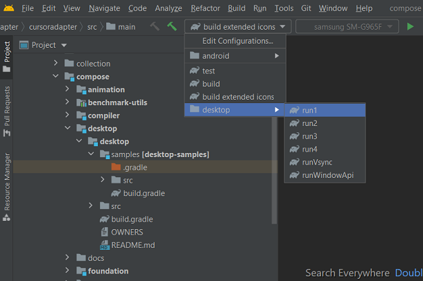

Composite build of [Compose-jb sources](https://github.com/JetBrains/androidx)

Download submodules after downloading the main project:
```
git submodule update
```
Set this property to always update submodules on git checkout/pull/reset:
```
git config --global submodule.recurse true
```

Requirements to build in terminal:
- Java 11 (should be specified in JAVA_HOME)
- Android SDK (should be specified in ANDROID_SDK_ROOT)
  - Android 11
  - Build-Tools 30.0.2
  - NDK 21.3.6528147 (in folder $androidSdk/ndk, not in $androidSdk/ndk/$version)
  - CMake 3.10.2.4988404 (in folder $androidSdk/cmake, not in $androidSdk/cmake/$version)

Requirements to develop in IDE:
- Android Studio Arctic Fox | 2020.3.1 Canary 15
- Custom Gradle 7.0 specified in `Settings -> Build, Execution, Deployment -> Build Tools -> Gradle` (because Android Studio will pick the wrong Gradle in subproject instead of the Gradle in the root project)
- Specified Gradle JDK 11 in `... -> Build Tools -> Gradle`
- Set environment variables from ./gradlew (see "Modified environment variables")

Build artifacts:
```
./gradlew buildComposeJb
```
Build artifacts on Windows:
```
gradlew buildComposeJb -x :support:compose:ui:ui-inspection:assembleInspectorJarRelease -x :support:compose:ui:ui-inspection:dexInspectorRelease
```
Artifacts will be in `out/androidx/build/support_repo/org/jetbrains/compose`

Run tests:
```
./gradlew testComposeJb
```